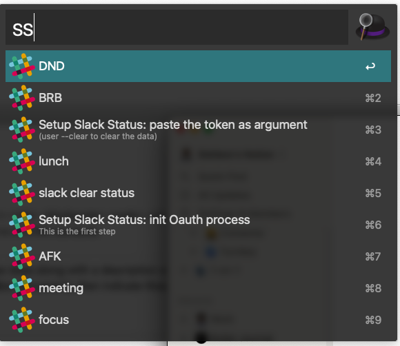
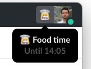

This workflow allows you to set your slack status via Alfred.

It has pre-defined set of statuses, but by modifying the workflow you can add yours.

# Setup
Since Slack has changed auth flow, you have to add this app to your Slack and perform an Oauth Login 

Then in Alfred do the following:

- `sssetup` and init the Oauth operation, the slack webpage will open and you will be prompted with Oauth
- A redirect to a page will show you your token, it's `xoxp-..`
- Copy the token
- run `sssetup` but select "paste token" and add the token as parameter of that action
- a notification that token has been saved is shown.

# Usage:

List of commands:

- `ssbrb`: set status as BRB: asks for DND and to Close Slack
- `ssfocus`: Focus  asks for DND and to Close Slack
- `ssdnd`: Do not Disturb  asks for DND and to Close Slack
- `ssmeeting`: In a Meeting  asks for DND and to Close Slack
- `ssafk`: Away From Keyboard  asks to Close Slack
- `sslunch`: Lunch time  asks to Close Slack
- `ssclear`: Resets the status (and reopens Slack)

Result (of lunch command):

## Details
The statuses ask (via filter list) for DND: this means that the snooze is set to false aka you don't get notifications.

Some of them also asks if you want to close Slack app. If so it will be reopened as soon as the status expires.

e.g. `ssbrb` > `yes` > `yes` : will set the BRB, set the snooze and close the Slack app. After 10 minutes (that's the default for that status) the status and snooze will be reset. The slack App will be opened automatically.

In fact, each status has a default duration, but you can also specify your duration by inputing the number in minutes, e.g. `ssbrb 15` will set BRB for 15 minutes.

**NOTE: if you specify `0` it will not be reset and slack will not automatically be reopened. Slack statuses expire at 00:00.**

#Editing existing statuses or adding others. 

All status settings are in the Arg&Vars object that follows each command, the fields are:

- `default`: the default minutes that applies to that status
- `dnd`: set `--dnd` if you want the dnd (usually this is asked in the second step, but you can skip that and force the dnd)
- `close`: set `--close` if you want to close the App(usually this is asked in the second step, but you can skip that and force the app to be closed)
- `icons`: the icon for the status
- `text`: the text for the status
- `minutes`: `{query}` : this is needed to pass the minutes to the script

You can modify existing or creating a new one.

You can connect directly this Args&Vars to `Main Script` if all the fields are set.

There's a python script that handles the update of the statuses.

# Extra
There are some tasks that I personally use to change my logs in my self-logging system. You can ignore them.